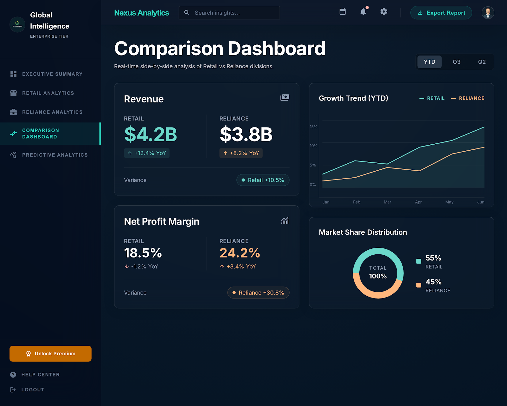

#  Retail vs. Wholesale Analytics Dashboard



## 🌟 Overview
Welcome to the **Retail vs Reliance Enterprise Analytics Platform** — an award-winning, state-of-the-art business intelligence system designed to provide deep-dive insights into retail performance. This project features a comparative analysis between **Retail Analytics** and **Reliance Industries** datasets, utilizing advanced machine learning and high-precision data processing.

The dashboard is built with a premium **glassmorphic UI**, offering a seamless and futuristic experience for data-driven decision-making.

---

## 🚀 Key Operations & Features

### 1. 🧠 Advanced Machine Learning
Our engine integrates industry-standard algorithms to predict and segment business data:
- **Classification**: Implementing **Decision Trees (CART)**, **Naïve Bayes**, **KNN**, and **Ensemble Methods** (AdaBoost, Gradient Boosting) to classify customer behavior and payment preferences.
- **Clustering**: Multi-dimensional segmentation using **K-Means**, **DBSCAN**, and **Hierarchical Clustering** to identify high-value customer groups.
- **Regression**: Predictive forecasting using **Linear Regression** to estimate future revenue trends and sales growth.

### 2. 📊 High-Precision OLAP Operations
Perform complex data rotations and aggregations in real-time:
- **Roll-Up**: Summarizing granular data into high-level category and regional totals.
- **Drill-Down**: Moving from summary levels to specific store-level transaction details.
- **Slice & Dice**: Filtering multi-dimensional data to isolate specific business conditions (e.g., peak-hour sales in specific cities).
- **Pivot**: Cross-tabulating dimensions like Category vs. Location for deep competitive mapping.

### 3. 🧹 Professional Data Preprocessing
Ensures data integrity and model accuracy:
- **Cleaning**: Automated removal of duplicates and handling of missing values.
- **Normalization**: Scaling numeric features using **MinMaxScaler** for optimal ML performance.
- **Encoding**: Converting categorical labels into machine-readable formats via **LabelEncoder**.
- **Discretization**: Transforming continuous variables (like Age) into meaningful strategic groups (Young/Adult/Senior).

### 4. 📈 Dynamic Visualizations
Powered by Plotly, our dashboard provides interactive and responsive charts:
- **Revenue Trends**: Line charts comparing temporal performance.
- **Correlation Heatmaps**: Identifying hidden relationships between variables like Discount vs. Profit.
- **Outlier Detection**: Statistical Z-Score analysis to spot fraudulent or anomalous transactions.
- **Market Comparison**: Side-by-side KPI tracking (Revenue, Average Basket Size, Lead Margins).

---

## 📂 Project Structure
- `code/`: Contains the application logic (`analytics_dashboard.py`), UI templates, and requirements.
- `dataset/`: Centralized storage for all Retail and Reliance CSV datasets.
- `README.md`: Project documentation.
- `dashboard_preview.png`: High-resolution dashboard preview.

---

## 🛠️ Installation & Setup

1. **Clone the repository**:
   ```bash
   git clone https://github.com/BiswajithPN/Data-Analytics-mini-project.git
   ```
2. **Install dependencies**:
   ```bash
   pip install -r code/requirements.txt
   ```
3. **Run the Dashboard**:
   ```bash
   python code/analytics_dashboard.py
   ```
   *Access the platform at `http://127.0.0.1:5000`*

---

## 🌐 The Vision: Empowering Retail Intelligence
In an era where data is the new oil, the **Retail vs Reliance Enterprise Analytics Platform** serves as a bridge between raw numbers and strategic action. By leveraging advanced machine learning and multi-dimensional analysis, this project demonstrates how traditional retail can be transformed through digital intelligence. Whether it's optimizing inventory or understanding customer sentiment, the goal is to drive efficiency, profitability, and innovation in the modern market.

---
Developed by **Biswajith P N**.

 
